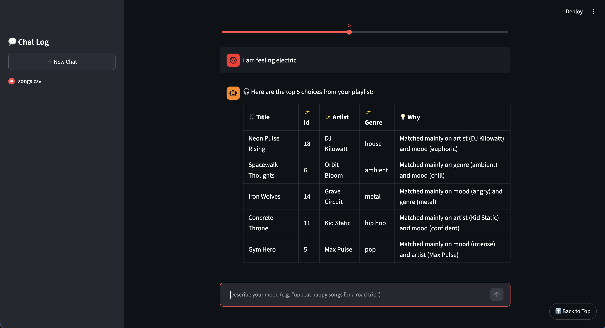
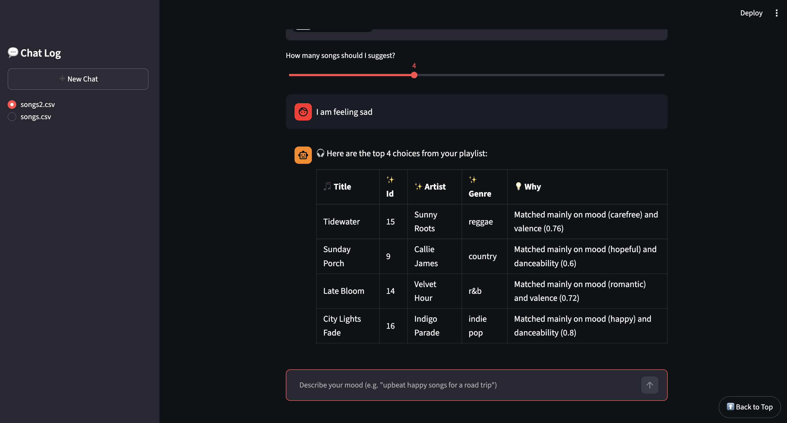

# 🎵 MixMaster

---

## Overview 

MixMaster is a user-friendly chatbot that makes the process of choosing between your favorite songs a hassle-free process. With just an upload of your favorite songs and a few words describing your mood, MixMaster is able to reccomend upto 10 top picks. It also explains why each song was chosen. File size is limited to 200mb, which is enough upload size for hundreds of songs for MixMaster to choose from. MixMaster is a RAG system powered by a local embedding model (`sentence-transformers`, running entirely on your machine with no API key or internet connection required after the first download) and cosine similarity. Behind the scenes, every uploaded song's fields (genre, mood, artist, etc.) are combined into text and converted into a numerical embeddings, and your mood description is embedded the same way; MixMaster then ranks songs by how close their embedding is to your request. This makes MixMaster a quick and efficient way to filter out songs based on your mood on any given day!


MixMaster is an extension of a previous project "🎵 Music Recommender Simulation". The original project was a CLI based reccomendation system that reccomended songs based on a fixed formula of given features. Based on a set user given preference (represented as a dictionary), the system would return the top 5 results from the formula. MixMaster improves upon this project by introducing a UI, that enables users to directly upload their playlists and ask the chatbot to reccomend based on any given prompt. MixMaster also introduces word-embeddings and cosine similarity to provide more accurate and dynamic results.

Link To Presentation: https://docs.google.com/presentation/d/1ih5lFWjCVtqkMfcWSxu9vhDAlkdaaFQYgobL3hjvCfQ/edit?usp=sharing

---

## System Architecture 

This project is divided by two separate systems: the older CLI reccomender and the newly implemented MixMaster. Both systems are still being tested through human input, but the older CLI system has some pytests. For the full system architecture diagram see `architecture.mmd`. 

---

## Setup & Dependencies

### Requirements

- Python 3.9+
- Dependencies listed in `requirements.txt`: `pandas`, `pytest`, `scikit-learn`, `sentence-transformers`, `streamlit`, `tabulate`

### Installation

1. Create a virtual environment (optional but recommended):

   ```bash
   python -m venv .venv
   source .venv/bin/activate      # Mac or Linux
   .venv\Scripts\activate         # Windows
   ```

2. Install dependencies:

   ```bash
   pip install -r requirements.txt
   ```

### Running the CLI Recommender

From the project root:

```bash
PYTHONPATH=src python3 src/main.py
```

This loads `data/songs.csv` and prints ranked recommendations for a few built-in sample user profiles (edit `src/main.py` to try your own).

### Running MixMaster 

From the project root:

```bash
streamlit run src/app.py
```

This opens MixMaster in your browser. From there:

1. Upload a CSV of songs (e.g. `data/songs.csv` or `data/songs2.csv`) using the file uploader.
2. Once loaded, describe your mood in the chat box (e.g. *"upbeat happy songs for a road trip"*).
3. MixMaster returns your top picks in a table, along with an explanation of why each song was chosen.

Note: the first query in a session downloads and loads the `all-MiniLM-L6-v2` embedding model (~90MB) locally — this only happens once and runs fully offline afterward, with no API key required.

### Running Tests

Run the CLI recommender's test suite with:

```bash
pytest
```

---

## MixMaster Sample Demo Input



---

## MixMaster Reproducible Command-Line Execution

The commands below exercise MixMaster's actual retrieval pipeline (`src/rag.py`) directly from the command line — the same logic used inside the Streamlit UI — so results can be reproduced and graded without launching a browser.

**Command:**

```bash
cd src
python3 -c "
from rag import parse_uploaded_songs, build_index, retrieve, explain_match

with open('../data/songs.csv') as f:
    songs = parse_uploaded_songs(f)
matrix = build_index(songs)

query = 'upbeat happy pop songs'
results = retrieve(query, matrix, songs, k=3)
for song, score in results:
    print(f'{score:.2f} {song[\"title\"]:20} {explain_match(query, song)}')
"
```

**Example input:** `"upbeat happy pop songs"`

**Example output (actual, reproduced on this codebase):**

```
0.54 Rooftop Lights       Matched mainly on genre (indie pop) and mood (happy)
0.46 Sunrise City         Matched mainly on mood (happy) and genre (pop)
0.37 Island Drift         Matched mainly on genre (reggae) and artist (Sunny Roots)
```

---

## Design Decisions

I chose to create a RAG system that uses word embeddings to provide more accuracy to the responses compared to the old formula model. I chose not to call an API because I found it to be more complex and not worth the cost. Instead, I found that installing a 90mb model was more sustainable. 

I chose to build a streamlit app because I was already fimiliar with it, and it was easy to add elements. It was also simple to add webpage elements when needed. Overall, streamlit provided a easy way to build a user-friendly UI with support for many of the features I planned.

---

## Reflection of AI Usage

This final project has been a culmination of several other projects where I leveraged AI to understand and code more efficiently. Throughout each project, I learned how to use AI more responsibly: by first understanding the structure of the project, identifying an overview of each function in the code, and lastly evaluating/testing the correctness of the code. This process has helped me view AI less as a negative tool that strips authenticity, and more as a tool to understand and improve productivity.

---

## Evaluation & Reliability

| Test Input | Evaluation Criteria | Result |
| --- | --- | --- |
| `"upbeat happy pop songs"` | Retrieval returns relevant, correctly-ranked songs from `data/songs.csv` | ✅ Pass — top match "Rooftop Lights" (indie pop, happy) scored 0.54, followed by "Sunrise City" (pop, happy) at 0.46 |
| `"chill acoustic songs for studying"` | A real, well-formed query should not be flagged by the gibberish guardrail | ✅ Pass — `is_gibberish` returns `False` |
| `"xkjq"` | Keyboard-mashed nonsense should be rejected before retrieval runs | ✅ Pass — `is_gibberish` returns `True`, chatbot declines to answer |
| `"ok"` | Inputs under the minimum length (2 characters) should be rejected | ✅ Pass — `is_gibberish` returns `True` |
| Same query, different uploaded file (`songs.csv` vs `songs2.csv`) | Retrieval corpus should adapt to whichever file is uploaded, with no code changes | ✅ Pass — same query returns different, relevant songs from each file (see before/after example above) |
| Match explanation for a top result | Explanation should cite the specific field(s) that drove the match, not a generic fallback | ✅ Pass — e.g. "Matched mainly on genre (indie pop) and mood (happy)" |
| `"soos"` | Nonsense input should be rejected by the gibberish guardrail before retrieval runs | ❌ Fail — slipped past `is_gibberish` (contains a vowel, so the no-vowel/vowel-ratio checks don't catch it) and returned low-relevance, essentially random matches (e.g. "Tidewater," "Sunday Porch") with weak, unconvincing explanations |
| `"eecentric with a hint of sadness"` | A complex, nuanced (and slightly misspelled) mood description should return consistently relevant, well-matched songs | ❌ Fail — top result "Spacewalk Thoughts" (ambient, chill) only scored 0.28, and the result set mixed in songs with contradictory moods like "happy" ("Sunrise City," "Rooftop Lights") alongside the one genuinely fitting match, "Winter Piano Letters" (melancholic), which was ranked 3rd instead of 1st |

---

## Testing Summary

In general, I am satisfied with the new reccomendation system behind MixMaster. It introduces a new level of complexity with the option to run locally. One feature that I am not fully satisfied with is the guardrails, as I haven't found a way to truly capture all random text, most of it is hardcoded to specific cases right now.


---

## MixMaster: RAG Retrieval Extension

Beyond the fixed-catalog CLI recommender above, this project also includes **MixMaster** (`src/app.py` + `src/rag.py`), a Streamlit chatbot that extends retrieval to work over **custom, user-uploaded documents** instead of a single hardcoded `songs.csv`.

**How retrieval was extended:**
- Users upload *any* CSV as a new data source at runtime — the parser (`parse_uploaded_songs`) only assumes a title-like column exists; every other column is combined into a free-text "document" per song.
- Each document is embedded locally with `sentence-transformers` (`all-MiniLM-L6-v2`), and a free-text mood query is matched against these embeddings via cosine similarity — semantic retrieval, not exact keyword matching.
- Because the pipeline is schema-agnostic, swapping in a different data source (e.g. `data/songs2.csv`, a completely different playlist) changes the retrieval corpus with no code changes.

**Before/after example** — same query, two different uploaded data sources:

```
Query: "upbeat happy songs for a road trip"

--- data/songs.csv ---
Rooftop Lights       Matched mainly on mood (happy) and artist (Indigo Parade)
Slow Burn            Matched mainly on mood (romantic) and artist (Velvet Hour)
Sunrise City         Matched mainly on mood (happy) and genre (pop)

--- data/songs2.csv (different uploaded playlist) ---
City Lights Fade     Matched mainly on mood (happy) and artist (Indigo Parade)
Golden Hour Drive    Matched mainly on mood (happy) and artist (Amber Skyline)
Velvet Skyline       Matched mainly on artist (Slow Stereo) and mood (relaxed)
```

The same query pulls different, relevant results depending on which document is loaded, and each result's explanation (`explain_match`) is generated per song by comparing the query's embedding against that song's individual field embeddings — earlier iterations of this feature only did literal keyword matching, which produced the same generic "similar overall vibe" explanation for most results regardless of which song or file was used.